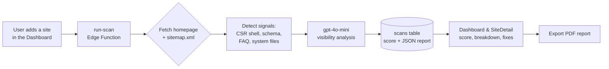

<div align="center">

# AIVO Insights

### See your website the way AI does.

**AIVO Insights analyzes how AI language models — ChatGPT, Claude, and Gemini — interpret, understand, and cite your website, then gives you a 0–100 AIVO Score and a prioritized list of fixes to improve your AI discoverability.**

[](https://aivoinsights.com)
[](#-license)

[](https://react.dev)
[](https://www.typescriptlang.org)
[](https://vitejs.dev)
[](https://tailwindcss.com)
[](https://supabase.com)
[](https://vercel.com)

[**Live Site**](https://aivoinsights.com) · [How It Works](#-how-it-works) · [The AIVO Score](#-the-aivo-score) · [Quick Start](#-quick-start) · [Architecture](#-architecture)

</div>

---

## 🧭 The problem

Search is moving from **ten blue links** to **one synthesized answer**. When someone asks ChatGPT, Claude, or Gemini for a recommendation, the model either cites your site — or it doesn't. Traditional SEO optimizes for crawlers and keywords; it says nothing about whether an LLM can *parse, trust, and quote* your content.

Most sites have no idea how they look through that lens. **AIVO Insights is the instrument that measures it.**

---

## ✨ What it does

- 🔍 **Scans any website** — enter a URL, AIVO fetches the page, follows the sitemap, and inspects the real, rendered structure.
- 🧠 **Grades it the way an LLM reads it** — six weighted dimensions, scored 0–100 by an AI visibility model.
- 🛠️ **Tells you exactly what to fix** — every scan returns prioritized, severity-rated recommendations with concrete suggested fixes and an effort estimate.
- 📈 **Tracks progress over time** — re-scan after changes and watch the score move; historical scans are retained per site.
- 🤖 **Catches the silent killer** — detects **client-side-rendered (CSR) shells** where your content is invisible to simple crawlers and most AI bots, and flags it as high severity.
- 📰 **Publishes its own content** — a fully automated daily blog pipeline generates SEO/GEO articles on a cron schedule.

---

## 🎯 The AIVO Score

The **AIVO Score** is a single 0–100 rating of how well AI models can interpret and cite your site. It's the weighted roll-up of six dimensions, each scored independently with a *reason* and an *improvement path to 100*:

| # | Dimension | What it measures |
|---|-----------|------------------|
| 1 | **Content Clarity** | Clear, factual writing — short paragraphs, scannable structure, unambiguous claims |
| 2 | **Semantic Structure** | Proper HTML5 semantics, heading hierarchy (`H1 > H2 > H3`), a logical document outline |
| 3 | **Schema & Metadata** | Schema.org / JSON-LD markup, Open Graph tags, meta descriptions |
| 4 | **Q&A Readiness** | FAQ sections, explicit question→answer pairs, definition lists, `FAQPage` schema |
| 5 | **Authority & Trust** | Author credentials, publication dates, source citations, expertise signals |
| 6 | **Technical Accessibility** | Fast loading, mobile-friendliness, clean HTML, no JavaScript rendering barriers |

Each completed scan returns a structured report:

```jsonc
{
  "overall_score": 75,
  "category_scores": { "content_clarity": 80, "semantic_structure": 70, "...": 0 },
  "category_feedback": {
    "content_clarity": {
      "score_reason": "Why this is the score",
      "improvement_path": "What to do to reach 100"
    }
  },
  "recommendations": [
    {
      "category": "technical_accessibility",
      "severity": "high",
      "title": "Implement SSR or prerendering",
      "description": "...",
      "suggested_fix": "...",
      "implementation_effort": "high"
    }
  ],
  "analysis_version": "1.4"
}
```

---

## ⚙️ How it works



1. **Add a site** in the dashboard (`name` + `url`). RLS guarantees you only ever see your own sites.
2. **`run-scan`** (Supabase Edge Function) authenticates the request, enforces rate limits, then fetches the homepage and parses `sitemap.xml` to discover same-origin pages.
3. **Signal detection** runs first — it strips scripts/styles to measure real text, flags a **CSR shell** when the rendered body is nearly empty, and detects FAQ/Question schema, Open Graph tags, and system files (`sitemap.xml`, etc.).
4. **AI analysis** sends the cleaned content + detected signals to **`gpt-4o-mini`** (`temperature: 0.3`, JSON-mode) with guardrails that *cap* scores when evidence is weak — e.g. CSR shells can't earn high clarity scores, and a missing FAQ caps Q&A readiness at 60. This is deliberately anti-hallucination.
5. **Results** are written to the `scans` table and rendered as an interactive breakdown with prioritized fixes — exportable to PDF.

---

## 🧱 Architecture

```
┌─────────────────────────────────────────────────────────────┐
│  Frontend (Vite + React 18 + TS, Tailwind, Framer Motion)    │
│  Marketing site · Auth · Dashboard · SiteDetail · Admin Blog │
└───────────────┬─────────────────────────────────────────────┘
                │  Supabase JS (anon key, RLS-enforced)
                ▼
┌─────────────────────────────────────────────────────────────┐
│  Supabase                                                     │
│  • Postgres + Row Level Security (per-user data isolation)    │
│  • Auth (email/password)                                      │
│  • Edge Functions (Deno):                                     │
│       run-scan · generate-blog · scheduled-blog-generation    │
│  • pg_cron + pg_net → daily blog generation                  │
│  • Vault → cron secrets                                       │
└───────────────┬─────────────────────────────────────────────┘
                │
                ▼
        OpenAI (gpt-4o-mini)  ·  Pexels (cover images)

Hosting: Vercel (SPA + prerender) with a hardened security-header layer
```

### Tech stack

| Layer | Choices |
|-------|---------|
| **Frontend** | React 18, TypeScript, Vite 5, React Router 7, Tailwind CSS, Framer Motion, Lucide icons |
| **Backend** | Supabase — Postgres, Auth, Edge Functions (Deno), `pg_cron`, `pg_net`, Vault |
| **AI** | OpenAI `gpt-4o-mini` (scan analysis & blog generation) |
| **Media** | Pexels API (blog cover images, server-side) |
| **Content** | `react-markdown` + `remark-gfm`, `react-quill` (admin editor), `marked` |
| **SEO/GEO** | Build-time sitemap generation + Puppeteer prerender for crawlable/citable HTML |
| **Hosting** | Vercel |

---

## 📂 Project structure

```
AIVO/
├── src/
│   ├── pages/             # Home, HowItWorks, FAQ, Blog, BlogPost, Dashboard,
│   │                      # SiteDetail, AdminBlog, Login, Signup, Privacy, Terms
│   ├── components/
│   │   ├── hero/          # Animated hero (neural net bg, particles, glowing CTA)
│   │   ├── layouts/       # MarketingLayout, DashboardLayout
│   │   ├── shared/        # Header, Footer, SEOHead, Breadcrumbs
│   │   ├── ui/            # Button, Input, AnimatedSection
│   │   └── features/      # ScanDetailsModal
│   ├── contexts/          # AuthContext (session + isAdmin)
│   ├── lib/               # supabase client
│   ├── utils/             # pdfExport
│   └── types/             # database types
├── supabase/
│   ├── functions/
│   │   ├── run-scan/                    # the AI visibility scan engine
│   │   ├── generate-blog/              # AI blog post generator (admin-gated)
│   │   ├── scheduled-blog-generation/  # cron entrypoint
│   │   └── _shared/                    # cors.ts, rate-limit.ts
│   └── migrations/        # schema, RLS, cron, rate-limit table
├── scripts/               # generate-sitemap.js, prerender.js, cron SQL helpers
├── public/                # robots.txt (AI crawlers allowed), sitemap.xml, assets
├── vercel.json            # security headers + path blocking + SPA rewrites
└── SECURITY.md            # security hardening log
```

---

## 🚀 Quick start

### Prerequisites

- **Node.js 18+**
- A **Supabase** project ([supabase.com](https://supabase.com))
- An **OpenAI** API key (for scan analysis & blog generation)
- *(Optional)* a **Pexels** API key (for auto-generated blog cover images)

### 1. Clone & install

```bash
git clone https://github.com/shadoprizm/AIVO.git
cd AIVO
npm install
```

### 2. Configure environment

Create a `.env` in the project root (it's gitignored):

```bash
# Frontend (Vite) — these are PUBLIC by design, baked into the client bundle
VITE_SUPABASE_URL=https://<your-project-ref>.supabase.co
VITE_SUPABASE_ANON_KEY=<your-anon-key>
VITE_ADMIN_EMAILS=you@example.com           # comma-separated, gates admin UI
```

> ⚠️ Anything prefixed `VITE_` is embedded in the public JS bundle. **Never** put a service-role key or a secret API key here. Secret keys belong in the Edge Function environment below.

Set **Edge Function** secrets in Supabase (Dashboard → Edge Functions → Secrets, or `supabase secrets set`):

```bash
SUPABASE_URL=https://<your-project-ref>.supabase.co
SUPABASE_SERVICE_ROLE_KEY=<service-role-key>   # server-side only
SUPABASE_ANON_KEY=<anon-key>
OPENAI_API_KEY=sk-...                          # required for AI analysis
OPENAI_MODEL=gpt-4o                            # optional, blog default
OPENAI_API_URL=https://api.openai.com/v1/chat/completions   # optional
ADMIN_EMAILS=you@example.com                   # server-side admin allowlist
PEXELS_API_KEY=...                             # optional, blog cover images
```

### 3. Set up the database

Apply the migrations (creates `sites`, `scans`, `blog_posts`, RLS policies, the rate-limit table, and the daily-blog cron):

```bash
supabase link --project-ref <your-project-ref>
supabase db push
```

### 4. Deploy the Edge Functions

```bash
supabase functions deploy run-scan
supabase functions deploy generate-blog
supabase functions deploy scheduled-blog-generation
```

### 5. (Optional) Wire up the daily blog cron

Run the helper SQL in the Supabase SQL Editor:

```
scripts/setup-blog-cron-secrets.sql   # stores cron secrets in Vault
scripts/verify-blog-cron.sql          # verifies extensions, job, secrets
```

### 6. Run it

```bash
npm run dev          # http://localhost:5173
npm run build        # typecheck + build + Puppeteer prerender
npm run preview      # preview the production build
npm run lint         # eslint
```

---

## 🔬 The scan engine in depth

The heart of the project is [`supabase/functions/run-scan/index.ts`](supabase/functions/run-scan/index.ts):

- **Authenticated & owned** — every scan validates the caller's JWT and confirms the target site belongs to that user (`sites.user_id = auth.uid()`).
- **Rate limited twice** — per-IP sliding window (10/min) *and* a per-site cap (5 scans/hour).
- **Sitemap-aware crawl** — fetches `/sitemap.xml`, normalizes same-origin links, and assembles the page set to analyze.
- **CSR-shell detection** — strips `<script>`/`<style>`/tags and measures the remaining text; a near-empty body marks the site as a *client-side-rendered shell*, which is invisible to most AI crawlers and triggers a high-severity `rec-csr-fix` recommendation to add SSR/prerendering.
- **Structured signal extraction** — detects `FAQPage`/`Question` schema, Open Graph tags, and system files before any AI call.
- **Evidence-bounded scoring** — the prompt explicitly *caps* categories when proof is missing (e.g. missing FAQ → Q&A readiness ≤ 60) and forbids hallucinating content it couldn't see. Output is strict JSON (`response_format: json_object`).
- **Versioned** — reports carry an `analysis_version` so methodology changes are traceable over time.

---

## 🗄️ Data model

| Table | Purpose | Access |
|-------|---------|--------|
| `sites` | User-registered websites (`name`, `url`, `last_scanned_at`) | RLS: owner-only CRUD |
| `scans` | One row per analysis run (`status`, `overall_score`, `analysis_json`) | RLS: read own; writes via Edge Function (service role) |
| `blog_posts` | Generated & published articles | Public read of `published = true` |
| `blog_generation_state` | Cron cursor — last topic index, counts | Backend-managed |
| `used_blog_images` | Dedupe tracking for cover images | Backend-managed |
| `rate_limits` | Sliding-window counters for Edge Functions | Backend-managed |

All user data is isolated with **Row Level Security** keyed on `auth.uid()`; scans are immutable after creation and only mutated by backend functions running on the service role.

---

## 📰 Automated content pipeline

`generate-blog` is an admin-gated, GEO-focused article generator: it picks the next topic from a curated `BLOG_TOPICS` set (focus keywords + target questions + subtopics), drafts the post with OpenAI, sources a cover image from Pexels, and stores it. `scheduled-blog-generation` is the cron entrypoint — `pg_cron` + `pg_net` fire it daily, advancing the topic cursor in `blog_generation_state` so the site continuously publishes fresh, AI-optimized content.

---

## 🔐 Security

Security is treated as a first-class concern and logged in [`SECURITY.md`](SECURITY.md):

- **Row Level Security** on all user tables, keyed to `auth.uid()`.
- **Authenticated, ownership-checked Edge Functions** with per-IP and per-resource rate limiting ([`_shared/rate-limit.ts`](supabase/functions/_shared/rate-limit.ts)).
- **CORS allowlist** restricted to production + localhost origins ([`_shared/cors.ts`](supabase/functions/_shared/cors.ts)).
- **Hardened HTTP headers** via [`vercel.json`](vercel.json): HSTS (preload), a strict Content-Security-Policy (no `unsafe-eval`), `X-Frame-Options: DENY` + `frame-ancestors 'none'`, COOP/CORP `same-origin`, `nosniff`, Referrer-Policy, and a locked-down Permissions-Policy.
- **Path blocking** — requests for `/.git`, `/.env*`, `*.sql`, `*.bak`, dumps, archives, and common scanner paths (`/wp-admin`, `/swagger`, …) return 404.
- **Secrets discipline** — only public `VITE_*` values reach the client; service-role and API keys live exclusively in the Edge Function environment.

Found a vulnerability? Please open a private report rather than a public issue.

---

## 🌐 SEO & GEO (it eats its own dog food)

AIVO Insights is itself optimized for the thing it measures:

- `robots.txt` explicitly **welcomes AI crawlers** (`GPTBot`, `ChatGPT-User`, `Google-Extended`, `CCBot`, `anthropic-ai`, `Claude-Web`).
- Build-time **sitemap generation** (`scripts/generate-sitemap.js`) and **Puppeteer prerendering** (`scripts/prerender.js`) ship crawlable, citable HTML for an otherwise client-rendered SPA.
- Rich JSON-LD, Open Graph, and Twitter Card metadata on every marketing and blog route.

---

## 🤝 Contributing

Issues and pull requests are welcome. For substantial changes, please open an issue first to discuss the direction. Run `npm run lint` and `npm run typecheck` before submitting.

---

## 📄 License

No open-source license is currently declared, so **all rights are reserved** by the author by default. If you'd like to use, modify, or distribute this code, please reach out — or watch this space for a `LICENSE` file.

---

<div align="center">

**Built to make the web legible to the machines that now read it.**

[aivoinsights.com](https://aivoinsights.com)

</div>
